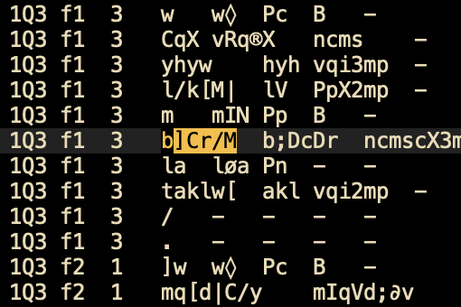

When I first started my thesis, I inherited the Dead Sea Scrolls project from another student in my lab. He provided a large file that looked something like this:\


I also inherited a complex spaghetti code that parsed this data into readable Hebrew text. These files (from the image above),  were created by [Martin Abegg](https://en.wikipedia.org/wiki/Martin_Abegg) and contain the raw text of the Dead Sea Scrolls, with morphological data on each word.

A few weeks later, I discovered the [text-fabric](https://github.com/annotation/text-fabric) package, a toolkit for analyzing large, structured text datasets, including ancient manuscripts, biblical texts, and other linguistically complex corpora. Popular among researchers in linguistics, biblical studies, and digital humanities.

This package actually parsing those files that looks like gibberish from Abegg, but with easy to use API.

For my purposes, I needed the entire corpus as plain text, along with some morphological features of each word. Here’s a quick guide on how to set it up:

**Disclaimer** 
The original documentation for this package is pretty good, but i felt that the learning curve was too steep for what I needed. This post is very simple, and it will be good if you need to do something similar to mine.
## Installation
Follow the instructions in [here](https://annotation.github.io/text-fabric/tf/about/install.html). 
If you having problems, you can try to install it with: `pip instal 'text-fabric[github]'`.

### Installation and Setup
(For more comprehensive guide check the [documentation](https://annotation.github.io/text-fabric/tf/index.html))
To get started, you’ll need to install `text-fabric` and load a dataset. 
Here’s an example using the ETCBC Hebrew Bible dataset:

```python
# Import Text-Fabric and load a dataset
from tf.app import use

# Load the Hebrew Bible (ETCBC dataset)
A = use('etcbc/bhsa', hoist=globals())
```

**Some basic operations:**
- Get the Text Structure: You can load text elements by type (book, chapter, verse) and navigate through them.

```python
# Get all books
for book in F.otype.s('book'):
    print(F.book.v(book))  # Prints book names
```

- Accessing Specific Text Data: Let’s retrieve a verse in Genesis.
```python
# Get Genesis 1:1
verse_node = T.nodeFromSection(('Genesis', 1, 1))
print(T.text(verse_node))  # Outputs the text of Genesis 1:1

```

- Accessing Metadata: You can retrieve metadata for specific elements like morphology or part of speech.
```python
# Get morphological and part of speech info for a specific word in Genesis 1:1
word_node = L.d(verse_node, otype='word')[0]  # First word in Genesis 1:1
print(F.lex.v(word_node), F.sp.v(word_node), F.g_cons.v(word_node))

```


## Implementation
For my case, i wanted to use the DSS dataset. the implementation is pretty straight forward: run over each scroll, store each word as a dict (each word have few attributes). That means we eventually end up with a dict of dict of dicts 
```cmd
{scroll1:[{text:ושמע, lex:שמע, ...}, {text:ה׳, lex:ה, ...}], 
scroll2:[{text:רצה, lex:רצה, ...}, {text:משה, lex:משה, ...}]}
```
The value for each scroll is simply a list of the words of this scroll (with a lot features expect from the raw text).

### Simple run
In here, we will iterate over the whole corpus (scroll by scroll), and gather the words for each scroll (with the corresponding location in the scroll).


```python
from collections import defaultdict
from tf.app import use
from tqdm import tqdm

def get_scroll_and_chapter_info(word):
    """Get scroll and chapter information for a given word node."""
    scroll_and_chapter = A.sectionStrFromNode(word)
    scroll, chapter_info = scroll_and_chapter.split(" ")
    return scroll_and_chapter, scroll


def process_word(scroll_node, word_line_num, sub_word_num):
    single_scroll_data = defaultdict(list)
    for word in L.d(scroll_node, otype="word"): #running over all of the words of this scroll
        (
            scroll_and_chapter,
            scroll
        ) = get_scroll_and_chapter_info(word)
        transcript = T.text(word) #get raw text
        word_entry = {
            "book_and_chapter": scroll_and_chapter,
            "scroll_name": scroll,
            "transcript": transcript,

        }
        single_scroll_data[scroll].append(word_entry)
    return single_scroll_data


A = use("ETCBC/dss", hoist=globals()) #here we will load the DSS (dead sea scrolls) data

all_scrolls = defaultdict(list)
for scroll_node in tqdm(F.otype.s("scroll")): #running over all scrolls available
    word_line_num = 1 #first line
    sub_word_num = 1 #first place in the line
    scroll_data = process_word(scroll_node, word_line_num, sub_word_num)
    all_scrolls.update(scroll_data)

```


But in case you want to get much rich data you can use something more complex like:
```python
def get_morphological_features(word):
    """Extract morphological features for a given word node."""
    return {
        "sp": F.sp.v(word),
        "cl": F.cl.v(word),
        "ps": F.ps.v(word),
        "gn": F.gn.v(word),
        "nu": F.nu.v(word),
        "st": F.st.v(word),
        "vs": F.vs.v(word),
        "vt": F.vt.v(word),
        "md": F.md.v(word),
    }


def get_scroll_and_chapter_info(word):
    """Get scroll and chapter information for a given word node."""
    scroll_and_chapter = A.sectionStrFromNode(word)
    scroll, chapter_info = scroll_and_chapter.split(" ")
    frag_label, frag_line_num = chapter_info.split(":")
    return scroll_and_chapter, scroll, frag_label, frag_line_num


def process_word(scroll_node, word_line_num, sub_word_num):
    single_scroll_data = defaultdict(list)
    for word in L.d(scroll_node, otype="word"):
        (
            scroll_and_chapter,
            scroll,
            frag_label,
            frag_line_num,
        ) = get_scroll_and_chapter_info(word)
        transcript = T.text(word)
        lexeme = F.glex.v(word)
        morphological_features = get_morphological_features(word)
        lang = F.lang.v(word)
        srcLn = F.srcLn.v(word)
        word_type = F.type.v(word)
        after = F.after.v(word)

        word_entry = {
            "frag_label": frag_label,
            "frag_line_num": frag_line_num,
            "word_line_num": str(word_line_num),
            "sub_word_num": str(sub_word_num),
            "book_and_chapter": scroll_and_chapter,
            "scroll_name": scroll,
            "transcript": transcript,
            "lex": lexeme,
            "parsed_morph": morphological_features,
            "lang": lang,
            "srcLn": srcLn,
            "type_of": word_type,
            "after": after,
        }
        

        if (
            not after
        ):  # If there is no space after the word, it means it's a conjunction like ו or ב.
            sub_word_num += 1
        else:
            sub_word_num = 1
            word_line_num += 1

        single_scroll_data[scroll].append(word_entry)
    return single_scroll_data

```

That's it, from here you can do whatever you want with the data.
For more context and much ordered pipeline you can take a peek in here: [main_ETL.py](https://github.com/yonatanlou/QumranNLP/blob/main/src/ETL/main_ETL.py).