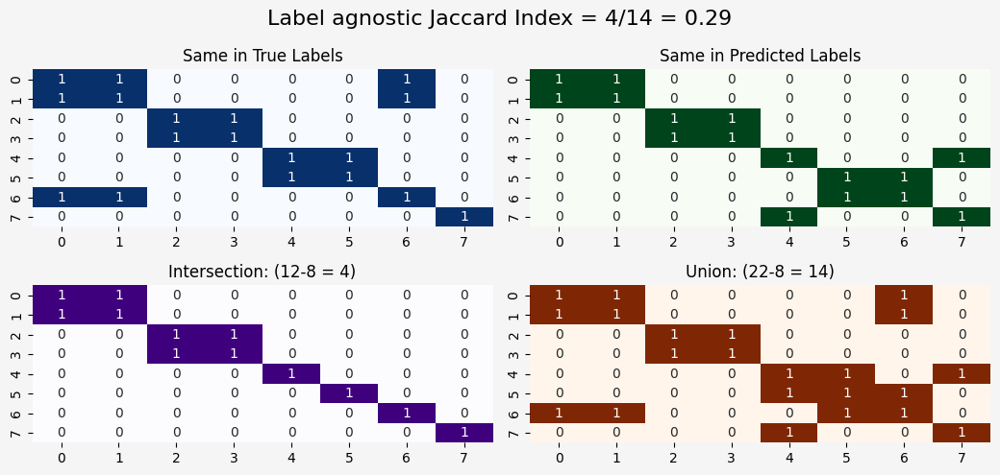
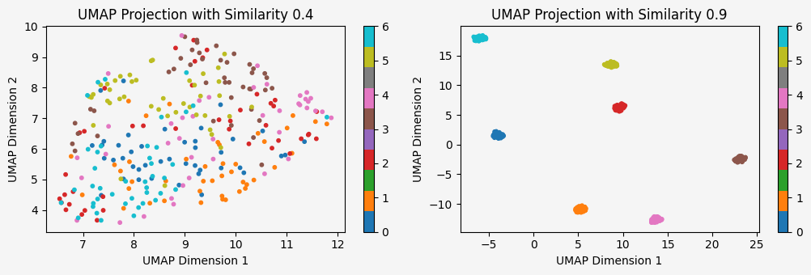
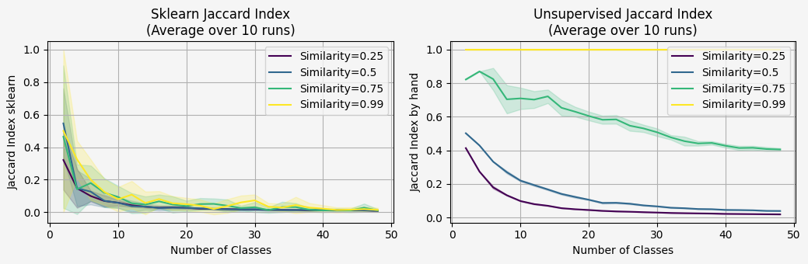

<a target="_blank" href="https://colab.research.google.com/github/yonatanlou/notebooks/blob/main/Jaccard_index_for_unsupervised_clustering.ipynb">
  
</a>

TL;DR - Don't use sklearn jaccard_score function when dealing with unsupervised clustering.


The Jaccard Index is a similarity measure used to compare the similarity and diversity of sample sets. It's calculated as the intersection divided by the union of sample sets. While it's a useful metric, its direct application in scikit-learn's `jaccard_score` is not suitable for unsupervised clustering scenarios.

### The Problem with Sklearn's Jaccard Score

Scikit-learn's `jaccard_score` is designed for supervised classification, where the true labels are known. It assumes that the predicted labels correspond directly to the true labels. In unsupervised clustering, however, we don't have ground truth labels. Instead, we have cluster assignments that can be permuted.

For instance, consider two cluster assignments: `[0, 0, 1, 1]` and `[1, 1, 0, 0]`. While these assignments represent the same clustering, the scikit-learn `jaccard_score` would incorrectly report a low similarity.

### Custom Implementation for Unsupervised Clustering

To address this limitation, we can implement a custom Jaccard Index calculation that is agnostic to label permutations, here is the function with example:


```python
import numpy as np
import matplotlib.pyplot as plt
import seaborn as sns
import matplotlib as mpl

BACKGROUND_COLOR = "#f5f5f5"
FIG_MAX_WIDTH = 10.5
FIGSIZE = (FIG_MAX_WIDTH, 3.5)
FIGSIZE_LONG = (FIG_MAX_WIDTH, 5)

mpl.rcParams["figure.facecolor"] = BACKGROUND_COLOR
mpl.rcParams["axes.facecolor"] = BACKGROUND_COLOR
mpl.rcParams["savefig.facecolor"] = BACKGROUND_COLOR

def calculate_jaccard_unsupervised(labels_true, labels_pred):
    labels_true = np.array(labels_true)
    labels_pred = np.array(labels_pred)

    # Create pairwise comparison matrices
    same_in_true = labels_true[:, None] == labels_true[None, :]
    same_in_pred = labels_pred[:, None] == labels_pred[None, :]

    intersection = np.logical_and(same_in_true, same_in_pred)
    union = np.logical_or(same_in_true, same_in_pred)

    nominator = intersection.sum() - len(labels_true) # For removing self comparisons
    denominator = union.sum() - len(labels_true)
    jaccard_index = nominator / denominator if denominator != 0 else 0.0

    return jaccard_index, same_in_true, same_in_pred, intersection, union

labels_true = [1, 1, 2, 2, 3, 3, 1, 4]
labels_pred = [4, 4, 3, 3, 2, 1, 1, 2]

jaccard_index, same_in_true, same_in_pred, intersection, union = calculate_jaccard_unsupervised(labels_true, labels_pred)

fig, axes = plt.subplots(2, 2, figsize=FIGSIZE_LONG)

sns.heatmap(same_in_true, annot=True, cmap="Blues", cbar=False, ax=axes[0,0])
axes[0,0].set_title("Same in True Labels")

sns.heatmap(same_in_pred, annot=True, cmap="Greens", cbar=False, ax=axes[0,1])
axes[0,1].set_title("Same in Predicted Labels")

sns.heatmap(intersection, annot=True, cmap="Purples", cbar=False, ax=axes[1,0])
axes[1,0].set_title(f"Intersection: ({intersection.sum()}-{len(labels_true)} = {intersection.sum()-len(labels_true)})")

sns.heatmap(union, annot=True, cmap="Oranges", cbar=False, ax=axes[1,1])
axes[1,1].set_title(f"Union: ({union.sum()}-{len(labels_true)} = {union.sum()-len(labels_true)})")

plt.suptitle(f"Label agnostic Jaccard Index = {intersection.sum()-len(labels_true)}/{union.sum()-len(labels_true)} = {jaccard_index:.2f}", fontsize=16)
plt.tight_layout()
plt.show()


```


    

    


This implementation first creates pairwise comparison matrices for both true and predicted labels. Then, it calculates the intersection and union of these matrices, accounting for the fact that cluster labels can be permuted.


First, i will make a function that will simulate data based on number of classes and how simliar those clusters are.


```python
try:
    import umap
except:
    !pip install umap-learn
    import umap

import numpy as np
import matplotlib.pyplot as plt
from sklearn.cluster import KMeans
from sklearn.metrics import jaccard_score
from sklearn.preprocessing import LabelBinarizer
from umap import UMAP


```


```python

def simulate_data(num_samples, num_features, similarity, num_classes, random_seed=42):
    """
    Generates synthetic data with a certain level of similarity between classes.
    You can implement more complex stuff like distance between clusters, etc.
    """
    np.random.seed(random_seed)

    data = []
    labels = []
    class_centers = np.random.rand(num_classes, num_features)  # Random centers for each class

    for i in range(num_classes):
        # Generate samples around the class center
        class_data = class_centers[i] + np.random.randn(num_samples // num_classes, num_features) * (1 - similarity)
        data.append(class_data)
        labels += [i] * (num_samples // num_classes)

    # Combine data and labels
    data = np.vstack(data)
    labels = np.array(labels)
    return data, labels


def plot_umap_projections(data1, labels1, data2, labels2, num_classes, similarity1, similarity2):
    """
    Reduces both datasets to 2D using UMAP and plots them side by side.
    """
    fig, axes = plt.subplots(1, 2, figsize=FIGSIZE)

    # UMAP projection for the first dataset
    umap1 = UMAP(n_components=2, random_state=0)
    data1_2d = umap1.fit_transform(data1)
    scatter1 = axes[0].scatter(data1_2d[:, 0], data1_2d[:, 1], c=labels1, cmap="tab10", s=10)
    axes[0].set_title(f"UMAP Projection with Similarity {similarity1}")
    axes[0].set_xlabel("UMAP Dimension 1")
    axes[0].set_ylabel("UMAP Dimension 2")
    plt.colorbar(scatter1, ax=axes[0], ticks=range(num_classes))

    # UMAP projection for the second dataset
    umap2 = UMAP(n_components=2, random_state=0)
    data2_2d = umap2.fit_transform(data2)
    scatter2 = axes[1].scatter(data2_2d[:, 0], data2_2d[:, 1], c=labels2, cmap="tab10", s=10)
    axes[1].set_title(f"UMAP Projection with Similarity {similarity2}")
    axes[1].set_xlabel("UMAP Dimension 1")
    axes[1].set_ylabel("UMAP Dimension 2")
    plt.colorbar(scatter2, ax=axes[1], ticks=range(num_classes))

    plt.tight_layout()
    plt.show()


num_samples = 300
num_features = 10
num_classes = 7


similarity1 = 0.4
data1, labels1 = simulate_data(num_samples, num_features, similarity1, num_classes)

similarity2 = 0.9
data2, labels2 = simulate_data(num_samples, num_features, similarity2, num_classes)

plot_umap_projections(data1, labels1, data2, labels2, num_classes, similarity1, similarity2)
```


    

    


Nice! So we can now control on the similiarity between clusters and the number of clusters.
Let's run a bigger simulation and measure the Jaccard measure:


```python
import numpy as np
import matplotlib.pyplot as plt
from sklearn.metrics import jaccard_score
from sklearn.preprocessing import LabelBinarizer
from sklearn.cluster import KMeans
from tqdm.notebook import tqdm


def calculate_jaccard_sklearn(labels_true, labels_pred):
    """
    Calculates the Jaccard index between true and predicted labels using sklearn.
    """
    lb = LabelBinarizer()
    labels_true_bin = lb.fit_transform(labels_true)
    labels_pred_bin = lb.transform(labels_pred)
    return jaccard_score(labels_true_bin, labels_pred_bin, average='weighted')

def calculate_jaccard_unsupervised(labels_true, labels_pred):
    """
    Calculates the Jaccard index between true and predicted labels without sklearn.
    """
    labels_true = np.array(labels_true)
    labels_pred = np.array(labels_pred)

    same_in_true = labels_true[:, None] == labels_true[None, :]
    same_in_pred = labels_pred[:, None] == labels_pred[None, :]

    intersection = np.logical_and(same_in_true, same_in_pred).sum() - len(labels_true)
    union = np.logical_or(same_in_true, same_in_pred).sum() - len(labels_true)

    return intersection / union if union != 0 else 0.0


def run_simulation(num_samples, num_features, similarity, class_counts, random_seed=42):
    """
    Runs the simulation for different numbers of classes and calculates both Jaccard indices for each case.
    """
    np.random.seed(random_seed)
    jaccard_sklearn_scores = []
    jaccard_unsupervised_scores = []

    for num_classes in class_counts:
        data, labels_true = simulate_data(num_samples, num_features, similarity, num_classes)

        kmeans = KMeans(n_clusters=num_classes, random_state=random_seed)
        labels_pred = kmeans.fit_predict(data)

        jaccard_sklearn = calculate_jaccard_sklearn(labels_true, labels_pred)
        jaccard_unsupervised = calculate_jaccard_unsupervised(labels_true, labels_pred)

        jaccard_sklearn_scores.append(jaccard_sklearn)
        jaccard_unsupervised_scores.append(jaccard_unsupervised)

    return jaccard_sklearn_scores, jaccard_unsupervised_scores

def run_multiple_simulations(num_samples, num_features, similarity, class_counts, n_runs=10):
    """
    Runs multiple simulations and returns mean and std of the scores.
    """
    sklearn_scores_all = []
    unsupervised_scores_all = []

    for run in tqdm(range(n_runs),desc="simulation"):
        sklearn_scores, unsupervised_scores = run_simulation(
            num_samples, num_features, similarity, class_counts, random_seed=run
        )
        sklearn_scores_all.append(sklearn_scores)
        unsupervised_scores_all.append(unsupervised_scores)

    sklearn_scores_all = np.array(sklearn_scores_all)
    unsupervised_scores_all = np.array(unsupervised_scores_all)

    return {
        'sklearn': {
            'mean': np.mean(sklearn_scores_all, axis=0),
            'std': np.std(sklearn_scores_all, axis=0)
        },
        'unsupervised': {
            'mean': np.mean(unsupervised_scores_all, axis=0),
            'std': np.std(unsupervised_scores_all, axis=0)
        }
    }

# Simulation parameters
num_samples = 10000
num_features = 10
class_counts = list(range(2, 50,2))
similarities = [0.25, 0.5, 0.75, 0.99]
n_runs=10

results = {}
for similarity in tqdm(similarities, desc="Processing similarities"):
    results[similarity] = run_multiple_simulations(
        num_samples=num_samples,
        num_features=num_features,
        similarity=similarity,
        class_counts=class_counts,
        n_runs=n_runs
    )


```


```python
# Create plots
fig, (ax1, ax2) = plt.subplots(1, 2, figsize=FIGSIZE)

colors = plt.cm.viridis(np.linspace(0, 1, len(similarities)))

# Plot sklearn results
for similarity, color in zip(similarities, colors):
    mean = results[similarity]['sklearn']['mean']
    std = results[similarity]['sklearn']['std']
    ax1.plot(class_counts, mean, label=f"Similarity={similarity}", color=color)
    ax1.fill_between(class_counts, mean - std, mean + std, alpha=0.2, color=color)

ax1.set_xlabel("Number of Classes")
ax1.set_ylabel("Jaccard Index sklearn")
ax1.set_title(f"Sklearn Jaccard Index\n(Average over {n_runs} runs)")
ax1.legend()
ax1.grid(True)

# Plot unsupervised results
for similarity, color in zip(similarities, colors):
    mean = results[similarity]['unsupervised']['mean']
    std = results[similarity]['unsupervised']['std']
    ax2.plot(class_counts, mean, label=f"Similarity={similarity}", color=color)
    ax2.fill_between(class_counts, mean - std, mean + std, alpha=0.2, color=color)

ax2.set_xlabel("Number of Classes")
ax2.set_ylabel("Jaccard Index by hand")
ax2.set_title(f"Unsupervised Jaccard Index\n(Average over {n_runs} runs)")
ax2.legend()
ax2.grid(True)

plt.tight_layout()
plt.show()
```


    

    


What we will expect to see in this simulation?
We will expect the data with high similiarity (clusters more dense), will get higher jaccard score.
Because ive used the same number of samples, with different number of classes, the jaccard will decrease - but we still expect to see the data with the high similiarity with much better jaccard score then the low similiarity.

The left plot it very very noisy, and we can't say if the which data setting is better.
This is make sense, because the sklearn implementation expecting to get prediction labels that correspond the actual labels.

That means that following setting will get 0 jaccard index:
```
from sklearn.metric import jaccard_score
a = [2,2,3,3,3,1,1,0]
b = [1,1,2,2,2,0,0,3]
jaccard_score(a,b,average="weighted")

#0
```
Which is not what we want when we doing unsupervised clustering.

### Relation to Adjusted Rand Index (ARI)

Both this **pairwise Jaccard** and **ARI** compare clusterings via **pairwise agreements**:

- **Jaccard (here):** \( J=\frac{TP}{TP+FP+FN} \) - considers only *positive pairs* (samples placed together in at least one partition).
- **Rand Index (RI):** \( RI=\frac{TP+TN}{TP+FP+FN+TN} \) - counts both “together” (TP) and “apart” (TN) agreements.
- **Adjusted Rand Index (ARI):** chance-corrected RI so random labelings score near 0.

In short, Jaccard focuses on co-cluster overlap (useful when you care about “who’s grouped with whom”), while ARI provides a chance-normalized agreement over all pairs. Both are **label-permutation invariant**.


### Conclusion
When evaluating unsupervised clustering algorithms, it's crucial to use metrics that are robust to label permutations. The custom Jaccard Index implementation presented here provides a reliable way to assess the similarity between true and predicted cluster assignments. By understanding the limitations of scikit-learn's jaccard_score in this context, we can make more informed decisions about the performance of our clustering models.


```bibtex
@misc{lou2025jaccard,
  author       = {Yonatan Lou},
  title        = {Jaccard Index for Unsupervised Clustering:},
  year         = {2024},
  howpublished = {\url{https://yonatanlou.github.io/blog/jaccard-index-unsupervised/Jaccard_index_for_unsupervised_clustering/}},
  note         = {Accessed: 2024-11-10}
}
```