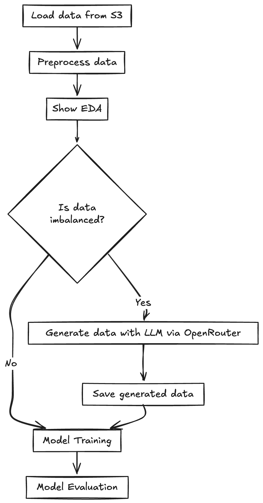

In the last ~5 years I've done a lot of research across various topics and places. I learned a ton, so this is where I'm dumping the main lessons from those years.

[Statistics Student, Analyst in the public sector, Analyst + Data Scientist at Forter, MSc in deep learning, LLM research in academia]

*This list is random, not sorted by importance*

## 1. Always write clean code

Most of the time, you're building a pipeline, and you simply don't know that it will go to production or be used hundreds of times. It's so easy to try different pandas operations in a Jupyter notebook and call things `tmp` or `sss`, but eventually, somebody will read this code. The amount of extra work it takes to write cleaner code isn't that hard, but the payoff is huge.

## 2. Managing experiments is harder than you think

As a researcher, you'll do a lot of experiments along the way. Doing multiple experiments can be very, very hard because the code changes, the data might not be linked to the code that ran the experiment, the data could change which means the analysis code needs to change, etc.

While there are tons of companies helping with managing experiments in the ML/LLM world (MLFlow, WB, LangFuse, and dozens more), for many cases you want something flexible that's easy to use for yourself. Personally, I like creating simple runnable code using CLI, where the output gets written to a dedicated folder with logs of the run. Then I use git for saving the data (or data path if it's heavy) along with the code that ran it. When you're working at a big company you'll have much better tools, but if you can do it by yourself, you can do it on any platform.

## 3. Learn to actually debug your code

Many data people only use notebooks, which is nice and convenient, but it's important to be able to actually debug your code step by step. I feel like juniors don't have this skill because they can just "vibe code" the problems with some LLM (which works sometimes!), but if you want to actually understand what's going on with a complex project, you'll have to debug it properly at some point.

## 4. Present clear results (but keep the details somewhere)

When you work on hard, multi-level problems, you have to make a lot of important decisions. When I started research, I read tons of papers and got frustrated that they didn't elaborate on small things that mattered (or only mattered to me). So when I needed to write about my problem, methodology and results, I always tried to include every tiny detail, and got mad when my advisor kept trying to cut things I was writing (which was annoying, especially when you wrote about good results that you worked hard on but weren't that important to the main story).

But now I understand that when presenting your problem, you have to focus on the important details so the reader can follow along. This doesn't mean dropping the tiny details—they can be somewhere else, like appendices or supplementary material.

## 5. Use graphs

Seriously, just visualize your data. Makes everything clearer.

## 6. Learn how to manage Python environments

I switched from pyenv to uv this last year, and it's been tremendous. This stuff matters more than you think.

## 7. When you have a complex workflow, draw it

I just found out that Excalidraw works with Mermaid, so you can simply write your pipeline description to an LLM in free text, get Mermaid code, and then render it in Excalidraw:

**Prompt:** 
```
write the following workflow in mermaid code:
load data from s3, then doing some preprocessing to data and showing some EDA.
Then we want to check if the data is imbalanced or not. if its imbalanced, generate data with llm via openrouter and save it. if the data is balanced, continue to model training, evaluation
```

<div style="display: flex; align-items: flex-start; gap: 20px;">
<div style="flex: 1;">

**Output:** 
```
graph TD
    A[Load data from S3] --> B[Preprocess data]
    B --> C[Show EDA]
    C --> D{Is data imbalanced?}
    D -->|Yes| E[Generate data with LLM via OpenRouter]
    E --> F[Save generated data]
    D -->|No| G[Model Training]
    F --> G
    G --> H[Model Evaluation]
```

</div>
<div style="flex: 1; text-align: center;">

</div>
</div>
    

This has been super helpful for explaining stuff to people and catching issues in my own thinking before I start coding.

8. **Always start with a baseline** - Too many times I jump right into the problem, using some unique features or super complex model without even trying the most easy thing. This is mainly happening when you developing something from scratch and you don’t have anything to compare to so it's pretty easy to forget it. I see a ton of papers which implements a very niche deep learning architecture which have very good metrics, but they don’t trying the very easy (and actual good) model such as representing text with TF-IDF with a simple model on top of it.